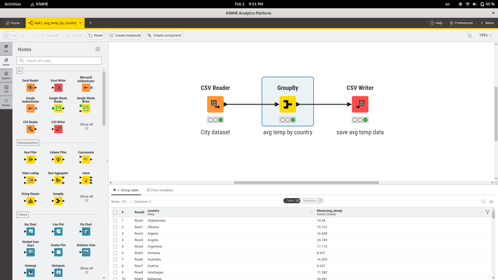
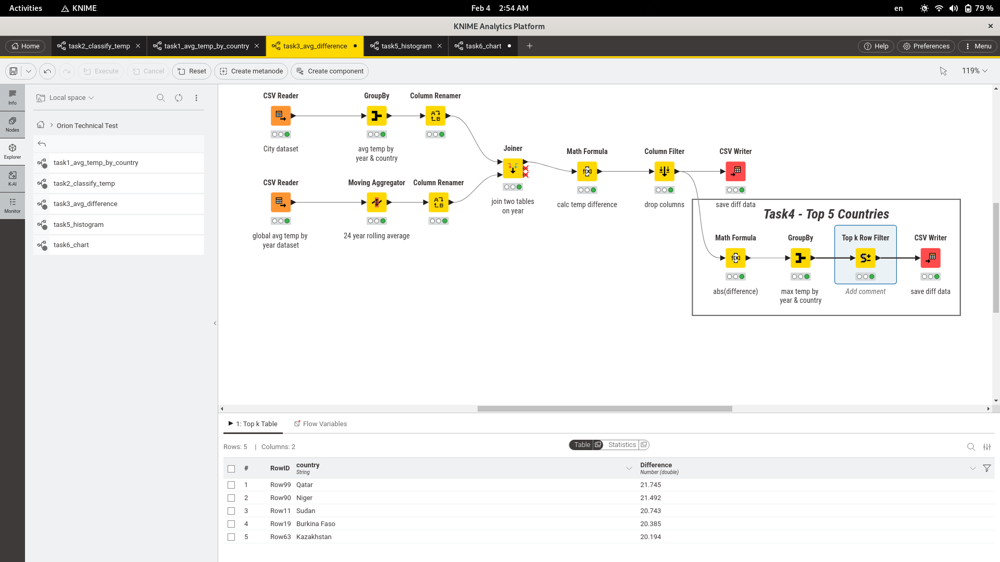

# Orion360-Technical-Test
In this repo I'm going to solve the technical task of **Orion Digital solutions**.

Before we start answering the task analytical questions let's first explore the dataset and make sure we understand the data.

The dataset represents the history of temperatures of the world in around 270 years.

<br/>

## Exploring The Dataset
We have `71311` records in the `city_data_table.csv` where `2547` of which are null values with a presentage of about `3.5%`.


We have gaps of missing values from 1 to up to 85 gap in `Port Louis` city in `Mauritius`.

<br/>

We have a number of approaches to handle this missing data:
1. Simply dropping the null values.
2. Filling the null values:
	1. With zeros.
	2. With mean.
	3. With city-wise mean.
	4. With Interpolation

<br/>

Let's farther investigate the dataset years, eventually we will do analytics based on the years, so let's make sure they all have the same years to aggregate on.


As we can see not all cities have records starting from the same `start_date` `(std is 42 in start_year)` but all of them end with the same `end_date` `2013` `(std is 0 in end_year)`.

- All cities have data until `2013`
- The oldest data starts in `1743` and the most recent city's data starts in `1882`
- Cities have between `132` and `271` years of recorded temperature data.
- Most cities have around `190–206` years of data.


To have the same ground-truth base data for all cities and countries to compare them against each other, we can filter the dataset with the start date as `1882` 


<br/>

### Conclusion on handling the null values and start date
We have a number of options here:
1. Drop the `3.5%` null records from the original `71311` records of data and continue the analysis with that, we are left with `96.5%` of the original data here.
2. Filter the original data with either start date as `1841` resulting in about `80%` of the original data, or  filtering with start date as `1882` to have the same years for all cities and counties for best accurate comparison, this will result in about `63.5%` of the original data.

We will go with the following two approaches and compare the results at the end:
1. Drop the `3.5%` null records (this option minimizes the data loss), dropping this `3.5%` null records verses filling them with whatever approach we mentioned above won't make mush of a difference here, so will go with the easier approach.
2. Filter the original data with start date as `1882` (this option same ground-truth base of comparison)

<br/>

A python script `prepare_data.py` is written to output two csv files for the two approaches to be used in analytics with  `KNIME`
```bash
(orion) Orion360-Technical-Test$ python3 prepare_data.py 
INFO:root:Reading city_data_table.csv....
INFO:root:Approach 1....
INFO:root:Saved city_data_approach1.csv
INFO:root:Approach 1 is done
INFO:root:Approach 2....
INFO:root:Saved city_data_approach2.csv
INFO:root:Approach 2 is done


(orion) Orion360-Technical-Test$ ls
city_data_approach1.csv  city_data_table.csv    global_data_table.csv  orion            README.md
city_data_approach2.csv  explor_datasets.ipynb  images                 prepare_data.py
```

<br/>
<br/>
<br/>

## KNIME Analytics 
I started by creating a workflow group called `Orion Technical Test` which will have all the tasks in it, a workflow for each task.

### 1- Output a table that has the overall average of each country
- In `task1_avg_temp_by_country` workflow for this task:
#### Approach 1
Using the `city_data_approach1.csv` as input in the `CSV Reader`


#### Approach 2
Using the `city_data_approach2.csv` as input in the `CSV Reader`


The saved output aggregated csv files for the two approaches:


<br/>
<br/>

### 2- Classify the countries Temperature into "Low/Mid/High"
- In `task2_classify_temp` workflow for this task:


We calculated this in **two ways**:
1. used `Auto-Binner` (the lower part), in which we define a fixed number of bins `3`, and then use `width` in `Equal`
   
2. used `Numeric Binner` with `Math Formula` and `Variables` (the upper part)
   - The `Numeric Binner` needs the classification values as input either statically typed or dynamically with variables, we went with the dynamic option.
   - To get the boundary values for `low/min/high`, we used two math formula one to get the `lower-mid-temp` and another to get the `higher-mid-temp`. 
	   - where the `lower-mid-temp` is defined as:
	     
	   - and the `higher-mid-temp` is defined as:
	     
	- The `Numeric Binner` then will use those to variables to define the classification boundaries as follows:
		- Low: `-inf to low-mid-temp`
		- Mid: `-low-mid-temp to high-mid-temp`
		- High: `-high-mid-temp to inf`
		


The saved output classification csv files for the two approaches:


<br/>
<br/>

### 3- Output a table that has the difference between the average of the country **in each year** and the average global temp in the last 24 years

- In `task3_avg_difference` workflow for this task:

To answer this question we read both csv files this time and then join them after aggregating the 24 years rolling average to the `global_data_table.csv` to get the average global temp in the last 24 years, and for the years which has less than 24 previous years `1750 to 1722` we compute the previous existing years average.

As we can see after the left join, there are some few null values, which indicates that there are some years that are present in the `city_data_table.csv` and does not exists in the `global_data_table`, they are the years `1743, 1744 and 1745`.

And since the task question emphasis on comparing with global average will continue with inner join.

After that we can simply take the difference between the two columns `avg_temp` and `previous_24_years_teamp_avg`


The saved output difference csv files for the two approaches:


<br/>
<br/>

### 4- Output a table that shows the top 5 countries that have the largest difference from the global Temp
- In `task3_avg_difference` workflow for this task:

- This question is a bit unclear, top 5 distinct countries for each year? or we take the average of each country across all years and take the top 5 of those ? or we get the maximum of each country across all years and take the top 5 of those.
- And since I emailed and got no answer to clarify this, I will go with the last assumption.

I used the same workflow of task3 and added the lower left part for task4, I used `max` as an aggregation method in the `GroupBy` node after taking the absolute value with `Math Formula` node to account for negative differences values.



The saved output top 5 countries csv files for the two approaches:


<br/>
<br/>

### 5- Draw a histogram for the yearly global temperatures
- In `task5_histogram` workflow for this task:


<br/>
<br/>

### 6- Choose any city and draw a chart to compare between this city and global average temperature over the past years
- In `task6_chart` workflow for this task:
- I've chosen `Alexandria` city in `Egypt` country by specifying that in the `Row Filter` node, and plotted that in a `line chart` node.

